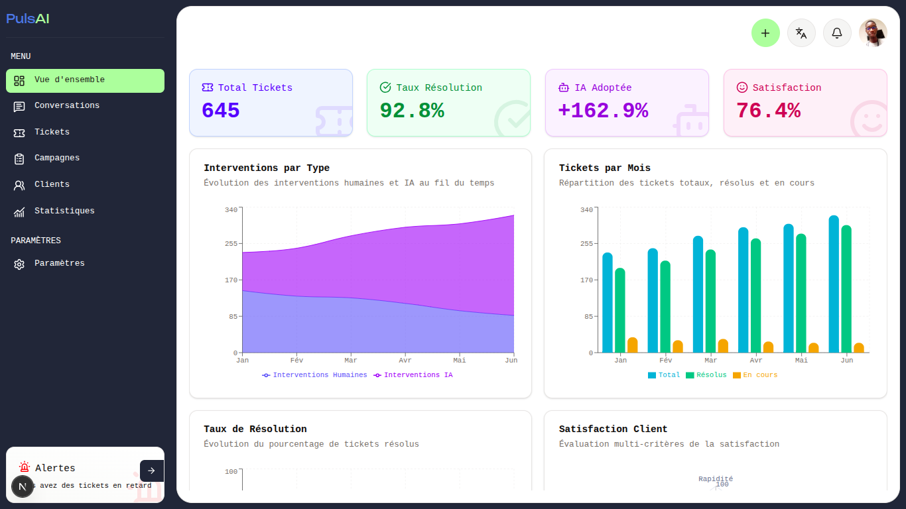
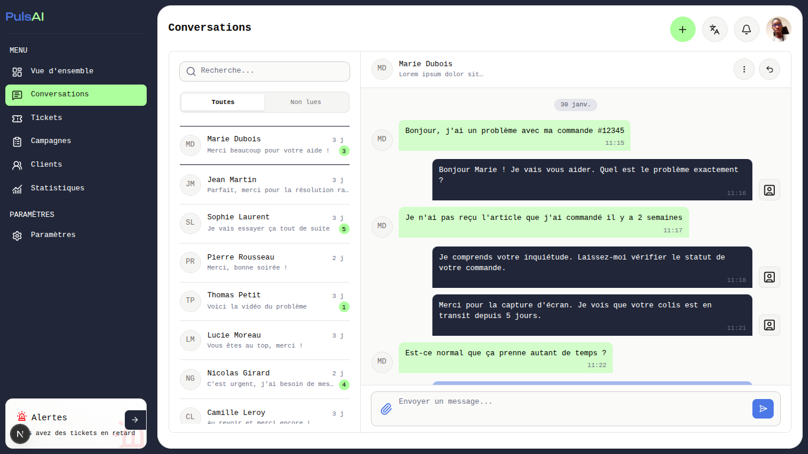
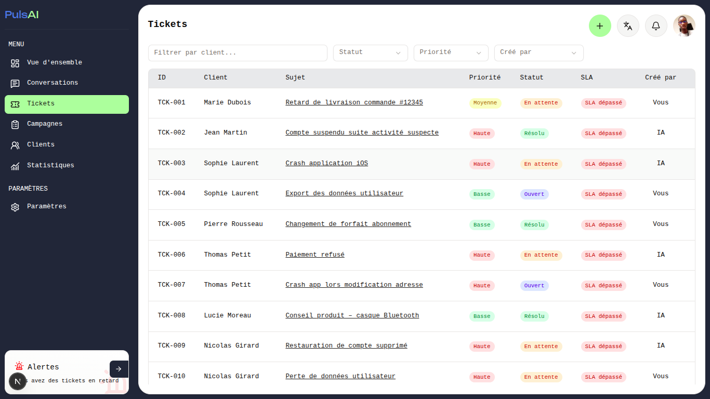
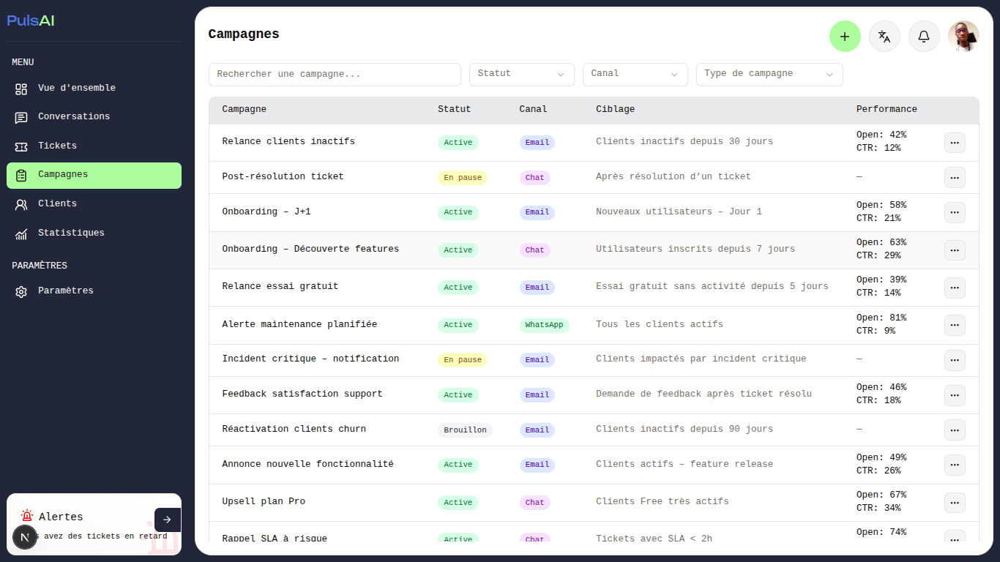
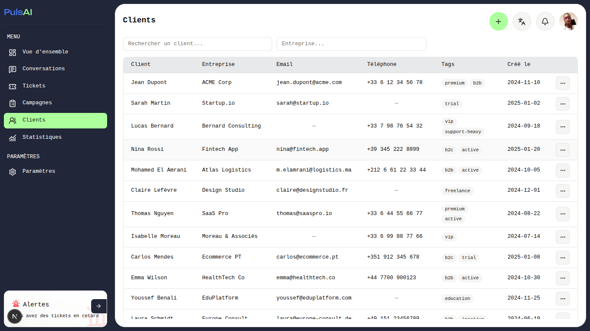

# PulsAI

## Description du projet
La plateforme `PulsAI` est un dashboard permettant au utilisateur d'automatiser la gestion de leur 

## Stack technique utilisée
- Framework : Next.js
- Styling : TailwindCSS
- Icônes : Lucide React
- Fichiers : en tsx
- Bibliothèque UI : [Shadcn UI](https://ui.shadcn.com/)
- Bibliothèque Hooks : [Haiku](https://www.reacthaiku.dev/) & [Usehooks-ts
](https://usehooks-ts.com/)

## Instructions d'installation
- Installer les dépendances
```bash
npm install
```

- Démarrer le projet
```bash
npm run dev
```

## Captures d'écran des principales pages

- Page de la vue d'ensemble des statistiques



- Page des conversations



- Page de la liste des tickets



- Page de la liste des campagnes



- Page de la liste des clients



## Liste des pages implémentées
- [Page de la vue d'ensemble des statistiques](http://localhost:3000/overview)
- [Page des conversations](http://localhost:3000/chats)
- [Page de la liste des tickets](http://localhost:3000/tickets)
- [Page de la liste des campagnes](http://localhost:3000/campaigns)
- [Page de la liste des clients](http://localhost:3000/custumers)
- [Page des paramètres](http://localhost:3000/settings)
- [Page 404](http://localhost:3000/404)